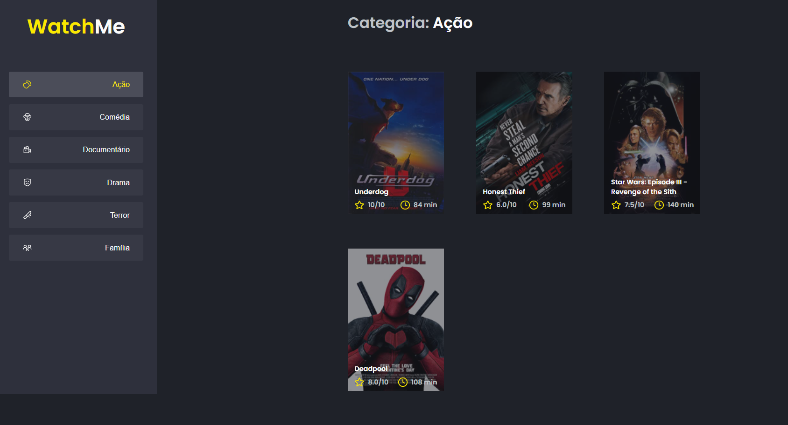

<h3 align="center">
  Challenge 02 - Creating Components for the application
</h3>

<p align="center">
  <a href="https://rocketseat.com.br">
    
  </a>
</p>

<br>

## 💻 About the challenge

<p align="center">
  
</p>

A quick challenge to practice ReactJS Components. The application was already working with a JSON Server Fake API. What I had to do was to split the application into components.

</br>

## 🖱 Technologies

- ReactJS
- TypeScript
- Sass

</br>

## ✔ Running the application

```bash

# Install all the dependencies
yarn

# Start JSON Server
yarn server

# Start the project
yarn start

```

<br>

## 📰 License

MIT. 
